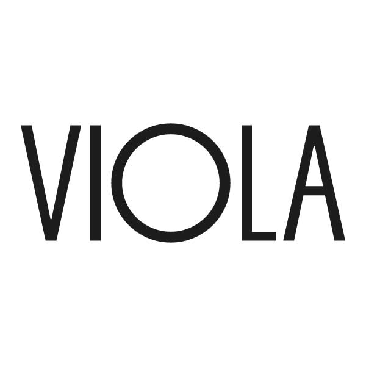

# Jindrich Polivka
                                 
## Hi, Iam Jindra 

                                       
## Visual identity for a small Prague  theatre
The plain look reflects look of the stage and auditorium as well as nature of the plays presented in it. These often use little to none in terms of scenery and costumes. The stage also host intimate musical performances and book readings besides theatrical plays.

                                                                                                                                                      

# Work
## Viola theatre
### Visual identity for a small theatre with long tradition.
### The plain look reflects look of the stage and auditorium as well as nature of the plays presented in it. These often use little to none in terms of scenery and costumes. The stage also host intimate musical performances and book readings besides theatrical plays.
                                                                        

### Posters work with a civil portrait of the leading actor(s) elsewhere than the stage, which further alludes to the intimate nature of this space, in which the actors are within an arms reach. Besides in case of this theatre the casting is typically more of a pull for it‘s audience than a given play as for it‘s small size it brings impressive starpower.

### Work on this projest was done in a team of 2 people, the opprotunity was part of our school program and took the form of a design competition

hemigway adjusted>

## I am aspiring to be a graphic designer. Currently studying at the University of creative communications in Prague in my 3rd year towards a bachelor's degree.
## Throughout my studies i have come in touch with different avenues of this field. And although im currently most enticed by the possibility of work in print media. Iam open to the challenge of other work as well. So dont hesitate to contact me with with any kind of project you would like to discus.
## Outside of design I spend my time playing with yoyos and making clothes.

# Work
## Viola theatre
### Visual identity for a small theatre with long tradition.
### The plain look reflects look of the stage and auditorium as well as nature of the plays presented in it. These often use little to no scenery and costumes. The stage also hosts intimate musical performances and book readings besides theatrical plays.
                                                                        
                                  
### Posters work with a civil portrait of the leading actor(s) from other environments than the stage. This further alludes to the intimate nature of this space, in which the actors are within an arm's reach. Besides, in case of this theatre the casting is greater enticement for the audience than a specific play. As for it‘s small size it brings impressive starpower.

### Work on this project proceeded in a team of 2 people, the oportunity was part of our school program and took the form of a design competition                                                       
