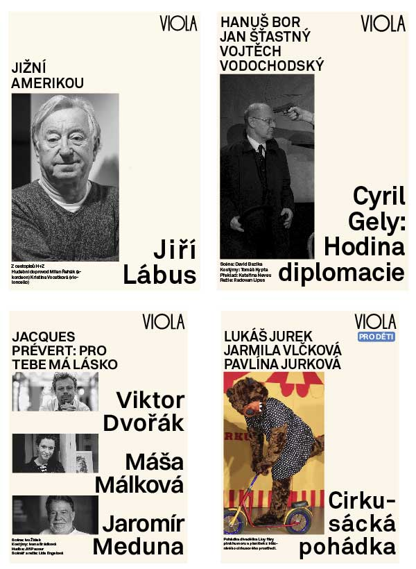

# case study

                                       
# Visual identity for a small Prague  theatre
The plain look reflects look of the stage and auditorium as well as nature of the plays presented in it. These often use little to none in terms of scenery and costumes. The stage also host intimate musical performances and book readings besides theatrical plays.

## logo process

The new logo matches look of the sign that has been hanging over the front entrance forever and so it already works as a part of the theatres identity. The word „DIVADLO“ is ommited in our logo as viola is a name that brings enough recognition in itself. Further it has been only slightly adjustedto appear better in print

## poster

Posters work with a portrait of the leading actor(s), which alludes to the intimate nature of this space, in which the actors are within an arms reach. In case of this theatre the casting is typically more of a pull for it‘s audience than a given play as for it‘s small size it brings impressive starpower. The typography then follows this unconventional practice with the casting in largest size, followed by the play‘s name set in all caps.

In case of this format not being applicable, the name of the play and castin change places and and are accompanied by a photograph from the play depicting an action rather than a portrait.

Performances aiming at children use a full color image and carrry a  „for children“ tag.

## program

All information in the program follows typographical rules set fo our posters. Hosting performance falls in line chronologically, but is highlighted with horizontal lines.

Two prints of the program can be placed into the information display continuusly flowing from one side to the next. Meaning only one kind of program needs to be designed and printed each month.

## anniversary logo, menu

part of the ne identity is also a menu for a bar which is a part of the theatre.
And a special version of the logo celebrating the 60 years anniversary.

## gallery poster

Theatre spaces also host vernisages for and adjoining galllery, those are identified by a poster  with different backghround color

Work on this projest was done in a team of 2 people, the opprotunity was part of our school program and took the form of a design competition
